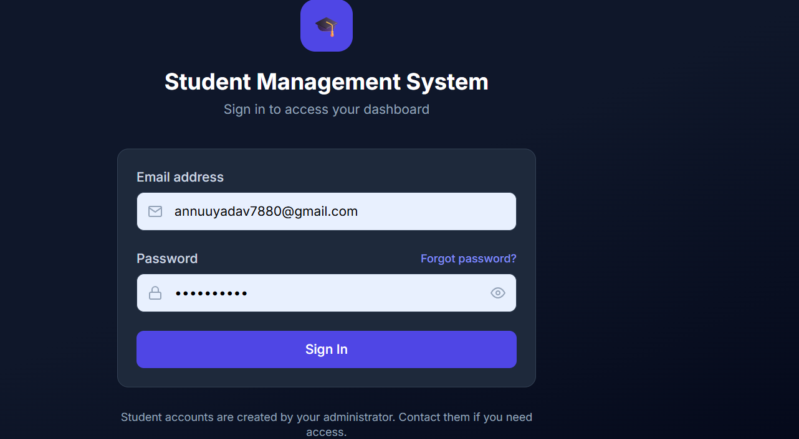
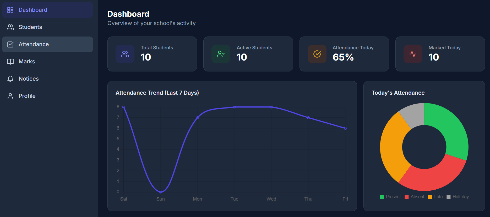
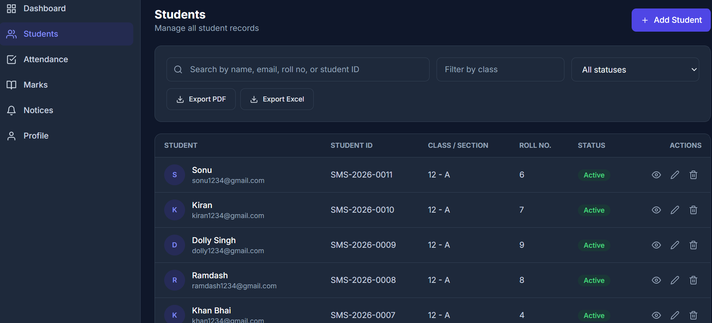
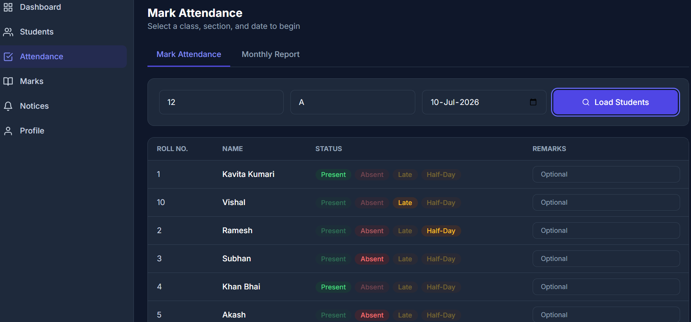
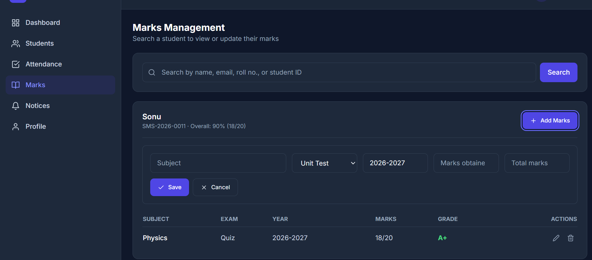
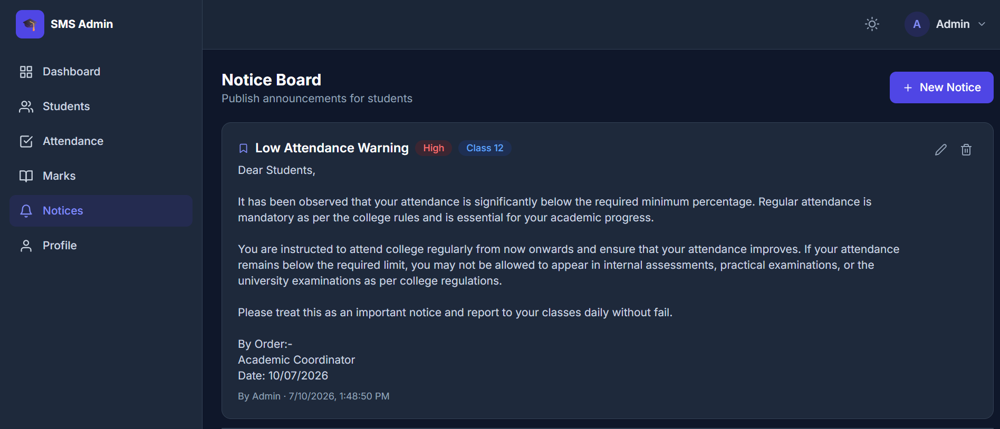

# 🎓 Student Management System

A modern Full Stack Student Management System built using **React, Node.js, Express.js, and MongoDB**. The system provides a secure platform for administrators and students to manage academic records, attendance, marks, notices, and profiles.

---

## 📸 Screenshots

> Add your screenshots inside a folder named **screenshots**.

| Login | Admin Dashboard |
|-------|-----------------|
|  |  |

| Student List | Attendance |
|--------------|------------|
|  |  |

| Marks | Notices |
|-------|----------|
|  |  |

---

# ✨ Features

## 👨‍💼 Admin Panel

- Secure Admin Login
- Dashboard with Statistics
- Student Management (Add, Edit, Delete)
- Attendance Management
- Marks Management
- Notice Management
- Student Profile Management
- Forgot Password using Email OTP
- Dark & Light Theme

---

## 🎓 Student Panel

- Secure Student Login
- Personal Dashboard
- View Attendance
- View Marks
- View Notices
- Update Profile
- Responsive UI

---

# 🛠 Tech Stack

## Frontend

- React.js
- Vite
- Tailwind CSS
- React Router DOM
- Axios
- Chart.js
- React Toastify
- React Icons

## Backend

- Node.js
- Express.js
- MongoDB Atlas
- Mongoose
- JWT Authentication
- Nodemailer
- Bcrypt

---

# 📂 Project Structure

```
sms-project
│
├── client
│   ├── src
│   ├── public
│   └── package.json
│
├── server
│   ├── controllers
│   ├── models
│   ├── routes
│   ├── middleware
│   ├── config
│   └── package.json
│
└── README.md
```

---

# ⚙ Installation

## Clone Repository

```bash
git clone https://github.com/anilsinghyadav954/Student-Management-System.git
```

## Go to Project

```bash
cd Student-Management-System
```

---

## Install Client

```bash
cd client
npm install
npm run dev
```

---

## Install Server

```bash
cd server
npm install
npm run dev
```

---

# 🔐 Environment Variables

Create a `.env` file inside the **server** folder.

```env
PORT=5000

MONGO_URI=YOUR_MONGODB_URI

JWT_SECRET=YOUR_SECRET

JWT_REFRESH_SECRET=YOUR_REFRESH_SECRET

SMTP_HOST=smtp.gmail.com
SMTP_PORT=465
SMTP_SECURE=true
SMTP_EMAIL=YOUR_EMAIL
SMTP_PASSWORD=YOUR_APP_PASSWORD

ADMIN_NAME=Admin
ADMIN_EMAIL=YOUR_ADMIN_EMAIL
ADMIN_PASSWORD=YOUR_PASSWORD
```

---

# 🚀 Future Improvements

- Student ID Card Generation
- PDF Report Download
- Fee Management System
- Parent Login
- Teacher Panel
- Mobile Application
- Push Notifications
- File Upload
- AI-powered Student Analytics

---

# 📈 Project Highlights

- JWT Authentication
- Role Based Access (Admin / Student)
- Email OTP Password Reset
- Responsive Design
- Dark Mode Support
- Dashboard Analytics
- REST API
- MongoDB Atlas Database

---

# 👨‍💻 Author

**Anil Yadav**

🎓 B.Tech (Information Technology)

GitHub:
https://github.com/anilsinghyadav954

---

# ⭐ Support

If you like this project, don't forget to ⭐ the repository.
